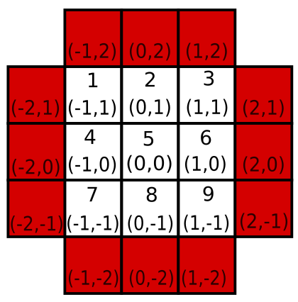

# advent of code 2016 - day 2

The first part of this puzzle asks us to find the combination to a conventional keypad:


The input is a collection of strings made up of L, R, D and U. Each line represents a number of moves.

Starting at 5 we need to find what number we are on after each line.

The inputs might go beyond the boundaries of the keypad, in which case those inputs are ignored.

e.g.

If we start at 5 and the inputs are:

```
ULL
RRDDD
LURDL
UUUUD
```

1) Start at 5 :: Up, Left, Left. This arrives at 1 as, the second Left is ignored.
2) Start at 1 :: Right, Right, Down, Down, Down. This arrives 9.
3) Start at 9 :: Left Up Right Down Left. This arrives at 8
4) Start at 8 :: Up Up Up Up Down. This arrives at 5


A solution for this is to define the keypad as a map of co-ordinates and keypad values, where 5 is (0,0).


```clojure
(def keypad
  {[-1 1] 1  [0 1] 2  [1 1] 3
   [-1 0] 4  [0 0] 5  [1 0] 6
   [-1 -1] 7 [0 -1] 8 [1 -1] 9})
```

Now define the set of all the invalid cells, this forms a boundary around the keypad:



```clojure
(def invalid-cells
  #{[-1 2] [0 2] [1 2] [-2 1] [-2 0] [-2 -1] [-1 -2] [0 -2] [1 -2] [2 -1] [2 0] [2 1]})
```

Now we just need to parse the input, process the moves. On each move we check if we arrive at an invalid cell, if we have then undo that move.

```clojure
(defn get-next-button [acc row]
  (reduce (fn [[x y] i]
            (let [[nx ny] (cond (= i "U") [x (inc y)]
                                (= i "D") [x (dec y)]
                                (= i "R") [(inc x) y]
                                (= i "L") [(dec x) y])]
              (if (invalid-cells [nx ny])
                [x y]
                [nx ny]))) acc row))

(let [input (->> (slurp "puzzle-inputs/2016/day2")
                 (str/split-lines)
                 (map #(str/split % #"")))]
  (->> (reductions get-next-button [0 0] input)
       (rest)
       (map keypad)
       (apply str)))
```
`Reductions` is a nice function here, it's like reduce but collects the intermediate values.

# Part 2

Part 2 has the same logic except the keypad is an irregular shape.


The above code already handles this, the only change that is needed is the keypad definition and the invalid cells.


```clojure
(def pt2-keypad
  {[2 2] 1
   [1 1] 2 [2 1] 3 [3 1] 4
   [0 0] 5 [1 0] 6 [2 0] 7 [3 0] 8 [4 0] 9
   [1 -1] \A [2 -1] \B [3 -1] \C
   [2 -2] \D})

(def pt2-invalid-cells
    #{[2 3] [1 2] [0 1] [-1 0] [0 -1] [1 -2] [2 -3] [3 2] [4 1] [5 0] [4 -1] [3 -2]})
```
