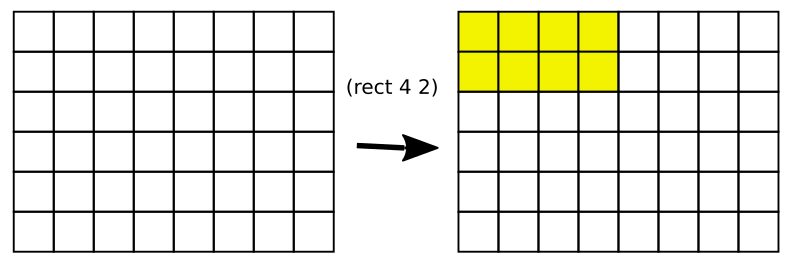
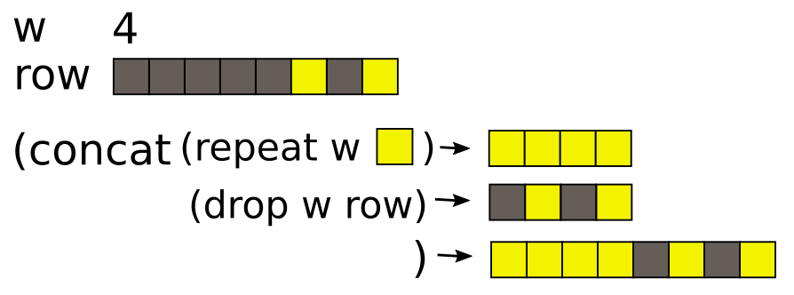
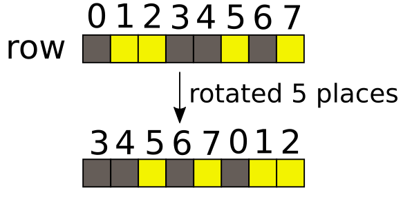
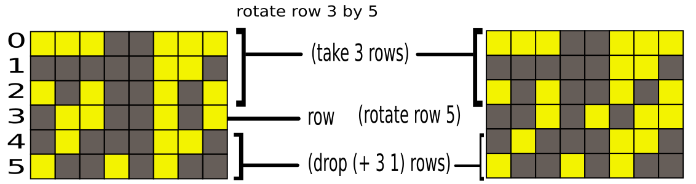
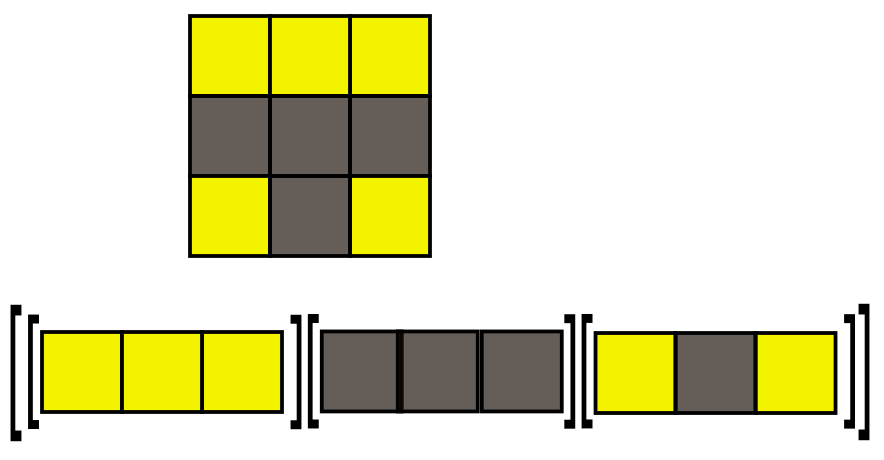
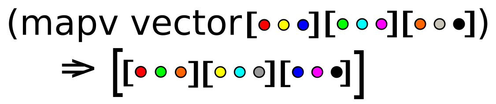
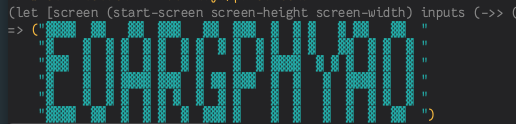

### aoc 2016 day 8

The puzzle is, given a screen of 50 x 6 pixels and a set of instructions for modifying what pixels are on / off, what message is displayed after all instructions are processed in order.

There are 3 types of instruction:

```
rect 4x2
rotate row y=0 by 3
rotate column x=0 by 1
```

## example inputs

```
rect 1x1
rotate row y=0 by 3
rect 2x1
rotate row y=0 by 7
rect 6x1
rotate row y=0 by 3
rect 2x1
rotate row y=0 by 2
rect 1x2
rotate row y=1 by 10
rotate row y=0 by 3
rotate column x=0 by 1
rect 2x1
rotate column x=20 by 1
rotate column x=15 by 1
rotate column x=5 by 1
```

I need to process all the lines in the puzzle input and produce a final image representing the screen so I can read the message.

## rect

`rect a x b` turns on the pixels in the rectangle `a` wide and `b` high in the top left hand corner (0,0) e.g.



Since it's purely just turning them on (as opposed to toggling), this is quite simple. I can create a function that takes a single row `row` and a width `w` and turns on the first `w` pixels in that row.

I just need to repeat the turned on indicator `w` times then concat the rest of the row:




```clojure
(defn turn-on-w-pixels [w row]
  (concat (repeat w \o) (drop w row)))
```

Then its just take h rows from the screen and map this function over them, then concat the rest of the screen back onto these new rows. This gives the new screen after the rect call.

```clojure
(defn rect [w h screen]
  (as-> (take h screen) o
        (map (partial turn-on-w-pixels w) o)
        (concat o (drop h screen))))
```

## Rotating a row

rotating rows is more interesting.

Rotating a row involves shifting it all right, and if pixels fall off the end they rejoin at the start:




But when you see the new row positions with the numbers above them its obvious I don't need to do any rotations at all.
Given a row of 8 pixels, a rotation of 5 is just splitting the row into the last 5 and the first 3 and swapping them.
To handle cases where the rotation value is larger than the width of the row you can just mod it by the row width.

Therefore rotating a single row is:

1) Take all the rows before the row to be rotated. Call these `rows_before`.
2) Take the row to be rotated.
3) Rotate that row. Call this `rotated_row`.
4) Take all the rows after the row to be rotated. Call these `rows_after`.
5) Concatenate `rows_before`, `rotated_row` and `rows_after` to reconstruct the screen.

Implementation:
```clojure
(defn rotate [places row-no screen]
  (let [before          (take row-no screen)
        to-rotate       (nth screen row-no)
        num-rows-before (- (count to-rotate) places)
        rotated         (concat (drop num-rows-before to-rotate)
                                (take num-rows-before to-rotate))
        after           (drop (inc row-no) screen)]
    (concat before [rotated] after)))
```

```clojure
(defn rotate-row [row-no places screen]
  (rotate places row-no screen))
```




## Rotating a column!

This should be the tricky part! However, there is a trick that makes this easy.
Rotating a column is the same as rotating a row, as long as I rotate the entire screen 90 degrees first, making the columns into rows and rows into columns. Then I can rotate a row (using the existing rotate-row function) and finally rotate the whole screen back again.

Internally I represent the screen as a vector of vectors. So a 3x3 screen would be a vector containg 3 vectors.
The first vector is a row 0, second vector is row 1 etc.



### (apply map vector screen)


To understand how `(apply map vector screen)` can rotate it, look at the `vector` function

```clojure
(vector :a :b :c)
;=> [:a :b :c]

```

If we pass multiple vectors to map:

```clojure
(mapv vector [:a :b :c] [:d :e :f] [:g :h :o])
=> [[:a :d :g] [:b :e :h] [:c :f :o]]
```

Or visually:




The apply is needed because the vectors that make up the screen are within an outer vector.


```clojure
(defn rotate-col [col-no places screen]
  (->> (apply map vector screen)
       (rotate places col-no)
       (apply map vector)))
```


## Parsing the puzzle input

```clojure
(defn parse-line [line]
  (cond 
        ;; handle rect axb instructions
        (str/starts-with? line "rect")
        (let [[x y] (rest (re-matches #"rect (\d+)x(\d+)" line))]
          (partial rect (Integer/parseInt x) (Integer/parseInt y)))

        ;; handle rotate column instructions
        (str/starts-with? line "rotate column")
        (let [[x y] (rest (re-matches #"rotate column x=(\d+) by (\d+)" line))]
          (partial rotate-col (Integer/parseInt x) (mod (Integer/parseInt y) screen-width)))

        ;; handle rotate row instructions
        (str/starts-with? line "rotate row")
        (let [[x y] (rest (re-matches #"rotate row y=(\d+) by (\d+)" line))]
          (partial rotate-row (Integer/parseInt x) (mod (Integer/parseInt y) screen-width)))))
```

This function returns a partially applied transformation function for each line in the puzzle input. These functions can then be input to a `reduce` call. Each function only requires the state of the screen as its non-applied parameter.

## Putting it all together

```clojure
(defn start-screen [h w]
  (repeat h (repeat w \x)))
  
(let [screen (start-screen screen-height screen-width)
      inputs (->> (slurp "puzzle-inputs/2016/day8")
                  (str/split-lines)
                  (map parse-line))]
  (->> (reduce (fn [acc i] (i acc)) screen inputs)
       (map (partial apply str))
       (map (fn [s] (str/replace (str/replace s "o" "▓") "x" " ")))))
```

Produces in the REPL:




## Full solution

```clojure
(def screen-width 50)
(def screen-height 6)

(defn turn-on-w-pixels [w row]
  (concat (repeat w \o) (drop w row)))

(defn rect [w h screen]
  (as-> (take h screen) o
        (map (partial turn-on-w-pixels w) o)
        (concat o (drop h screen))))

(defn rotate [places row-no screen]
  (let [before (take row-no screen)
        to-rotate (nth screen row-no)
        num-rows-before (- (count to-rotate) places)
        rotated (concat (drop num-rows-before to-rotate)
                        (take num-rows-before to-rotate))
        after (drop (inc row-no) screen)]
    (concat before [rotated] after)))
    
(defn rotate-row [row-no places screen]
  (rotate places row-no screen))
  
(defn rotate-col [col-no places screen]
  (->> (apply map vector screen)
       (rotate places col-no)
       (apply map vector)))
         
(defn start-screen [h w]
  (repeat h (repeat w \x)))
  
(defn parse-line [line]
  (cond (str/starts-with? line "rect")
        (let [[x y] (rest (re-matches #"rect (\d+)x(\d+)" line))]
          (partial rect (Integer/parseInt x) (Integer/parseInt y)))

        (str/starts-with? line "rotate column")
        (let [[x y] (rest (re-matches #"rotate column x=(\d+) by (\d+)" line))]
          (partial rotate-col (Integer/parseInt x) (mod (Integer/parseInt y) screen-width)))

        (str/starts-with? line "rotate row")
        (let [[x y] (rest (re-matches #"rotate row y=(\d+) by (\d+)" line))]
          (partial rotate-row (Integer/parseInt x) (mod (Integer/parseInt y) screen-width)))))
          
(let [screen (start-screen screen-height screen-width)
      inputs (->> (slurp "puzzle-inputs/2016/day8")
                  (str/split-lines)
                  (map parse-line))]
  (->> (reduce (fn [acc i] (i acc)) screen inputs)
       (map (partial apply str))
       (map (fn [s] (str/replace (str/replace s "o" "▓") "x" " ")))))
```
