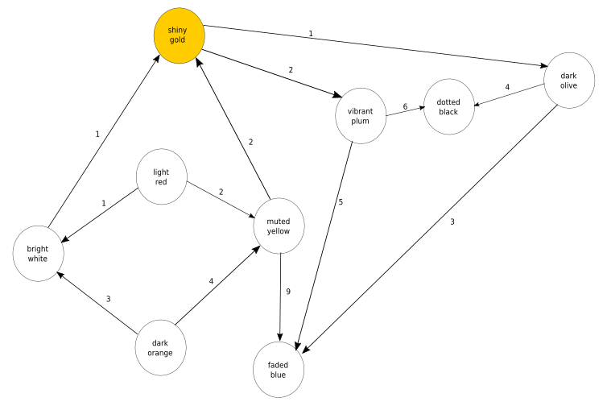
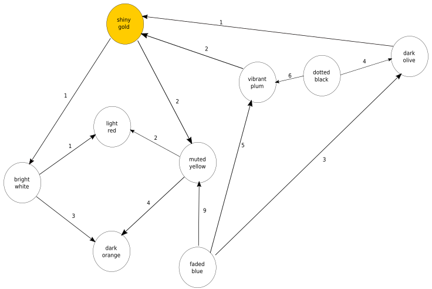

# Advent of Code 2020 Day 7

The puzzle link:
https://adventofcode.com/2020/day/7#part1

## Part 1
This puzzle involves calculating the number of ways we can arrive at a shiny gold bag when other bags can contain shiny gold bags.

Example test input:

```
light red bags contain 1 bright white bag, 2 muted yellow bags.
dark orange bags contain 3 bright white bags, 4 muted yellow bags.
bright white bags contain 1 shiny gold bag.
muted yellow bags contain 2 shiny gold bags, 9 faded blue bags.
shiny gold bags contain 1 dark olive bag, 2 vibrant plum bags.
dark olive bags contain 3 faded blue bags, 4 dotted black bags.
vibrant plum bags contain 5 faded blue bags, 6 dotted black bags.
faded blue bags contain no other bags.
dotted black bags contain no other bags.
```

If we want to carry a shiny gold bag the options are:

1) Put it in a bright white bag
2) Put it in a muted yellow bag
3) Put it in either a bright white bag or a muted yellow bag, inside a dark orange bag.
4) Put it in a bright white bag or a muted yellow bag, inside a light red bag.

So we have four options.

Given the full puzzle input, how many bag colors can we choose to carry our shiny gold bag?

This can solved using a directed weighted graph. The example test input as a directed weighted graph would look like:



From the above you can see the muted yellow node connects to the shiny gold. As does the bright white node.

If I want to find how many ways I can arrive at shiny gold, from any node, I need to transpose the graph. Which for a directed weighted graph means reversing each directed edge.

The transposed test graph:



Now I can start from shiny gold and see how many unique nodes I can arrive at.

In this case it's 4, as expected.

```
Shiny gold > Muted Yellow > dark orange
Shiny gold > bright white > light red
Shiny gold > bright white > dark orange
```

SO the unique nodes are:
1) muted yellow
2) dark orange
3) bright white
4) light red.


## Parsing the input

I want to parse a line of the input into the form

```clojure
{"parent"
  {"bag" weight "bag" weight}}
```

e.g.

```
light red bags contain 1 bright white bag, 2 muted yellow bags.

```
becomes

```clojure
{"light red" {"bright white" 1, "muted yellow" 2}}
```

and

```
dotted black bags contain no other bags.
```

becomes

```clojure
{"dotted black" {}}
```

The parsing code:

```clojure
(defn parse-bag [bag]
  (when (not= bag "no other bags")
    (let [reg (first (re-seq #"(\d+) (\w+ \w+) bag" bag))]
      [(nth reg 2) (Integer/parseInt (nth reg 1))])))

(defn parse-line [line]
  (let [[parent & rest] (str/split line #"contain|,")
       node (second (re-find #"(\w+ \w+) bags" (str/trim parent)))
       contained-bags (if (= "no other bags." (str/trim (first rest)))
                        {}
                        (->> (map str/trim rest)
                             (map parse-bag)
                             (reduce conj {})))]
      {node contained-bags}))

(defn parse-input []
  (->> (slurp "puzzle-inputs/2020/day7")
       (str/split-lines)
       (map parse-line)))
```


## Loom

https://github.com/aysylu/loom

Loom is a Clojure library for building graphs. It makes this problem simple. I just have to:

1) Build graph
2) Transpose the graph
3) Count the nodes reachable from "shiny gold"
4) Needs a final dec as the count includes the "shiny gold" node itself, which I don't want to include.

```clojure
(defn reachable-from-shiny-gold []
  (-> (apply lg/weighted-digraph (parse-input))
      (lg/transpose)
      (ld/subgraph-reachable-from "shiny gold")
      (lg/nodes)
      (count)
      (dec)))
```

